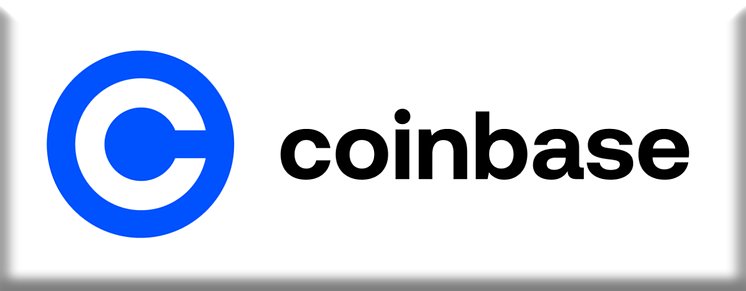

# Coinbase Case Study

## Contents
1. [Overview and Origin](#overview-and-origin)
2. [Business Activities](#business-activities)
3. [Landscape](#landscape)
4. [Results](#results)
5. [Recommendations](#recommendations)
6. [References](#references)

## Overview and Origin
Founded in June 2012 by Brian Armstrong, a former Airbnb engineer, and Fred Ehrsam, an ex-Goldman Sachs trader, Coinbase has established itself as a leading cryptocurrency exchange platform (Daily Coin, n.d.). The company's inception was supported by Y Combinator, a startup incubator program, which initially injected $150,000 into the venture (Daily Coin, n.d.).

Throughout its existence, Coinbase has successfully navigated numerous funding rounds, amassing $678.7 million across 19 distinct rounds (Crunchbase, 2023). Its most recent round of funding was a post-IPO debt round on September 5, 2023 (Crunchbase, 2023). The company's financial backing comes from a diverse pool of 78 investors, notably ARK Investment Management and ADM VENTURES (Crunchbase, 2023).

Coinbase reached a significant funding milestone in January 2015, securing an investment of $75 million from a group of investors, including Draper Fisher Jurvetson, the New York Stock Exchange, USAA, and several banks. In the same month, the company expanded its offerings by launching Coinbase Exchange, a U.S.-based bitcoin exchange tailored for professional traders (Daily Coin, n.d.).

## Business Activities

### Problem and Customers
Coinbase aims to address the complexities and security concerns associated with buying, selling, and managing cryptocurrencies. The company offers a secure, user-friendly platform that caters to a broad spectrum of users, including individual investors, cryptocurrency enthusiasts, traders, institutions, and businesses (FourWeekMBA, n.d.). Their services range from simple transactions to advanced trading and custody solutions, aiming to make cryptocurrency accessible and understandable for everyone (NerdWallet, 2023). Their global reach attracts users worldwide seeking cryptocurrency solutions and investment opportunities.

### Unique Solution and Technology
Coinbase differentiates itself with a multi-faceted approach:

1. **Trading Platforms:** Coinbase offers multiple platforms catering to beginners and experienced traders. These include the original Coinbase platform for simple transactions and Coinbase Advanced Trade for more sophisticated trading options. Additionally, Coinbase One provides no-fee trades for a monthly fee (FourWeekMBA, n.d.).

2. **Educational Resources:** Coinbase provides educational resources, including video classes and exams, to educate users about cryptocurrency trading. This "learn to earn" approach allows users to earn cryptocurrencies while learning about them (FourWeekMBA, n.d.).

3. **Quick Withdrawals:** Coinbase enables immediate withdrawal of cryptocurrencies after fiat currency purchases, benefiting users who want to use cryptocurrency in decentralized apps and other services (NerdWallet, 2023).

4. **Blockchain Infrastructure:** Coinbase’s infrastructure focuses on security, scalability, and stability. It is "blockchain agnostic," allowing easy integration of new blockchain technologies. Key aspects include immutability, ephemerality, consensus, and automation (AWS Startups Blog, n.d.).

5. **Snapchain and Network Load Balancers:** Coinbase uses Snapchain for deploying blockchain nodes and Network Load Balancers (NLBs) to manage snapshots and ensure reliable node operation, minimizing network sync time and enabling rapid redeployment of blockchain states (AWS Startups Blog, n.d.).

These technological innovations and strategic approaches position Coinbase as a comprehensive and user-friendly platform in the cryptocurrency market.

## Landscape

Coinbase operates within the blockchain and cryptocurrency domain, which has witnessed substantial technological progress and increased adoption in recent years (Deloitte Insights, 2023).

### Noteworthy Trends

- **Beyond Speculation:** Blockchain and distributed ledger technologies (DLTs), initially linked with cryptocurrencies, have evolved to facilitate a broad spectrum of business applications across various industries, creating new value-creation opportunities (Deloitte Insights, 2023).

- **Technological Advancements:** Initial generations of blockchain and DLTs encountered issues such as slow transaction speeds and high energy consumption. However, recent developments have resulted in more practical and scalable solutions like nonpublic and permissioned networks, thus spurring enterprise adoption (Deloitte Insights, 2023).

- **Innovation Ecosystems and Interoperability:** The advent of new protocols and platforms has enhanced interoperability among blockchain platforms, promoting collaboration and data sharing across multiple industries (Deloitte Insights, 2023).

- **Diverse Industry Applications:** Blockchain technologies are used in sectors beyond financial services, including healthcare, retail, and government. Applications range from secure data-sharing, intercompany accounting, supply chain transparency, and creator monetization (Deloitte Insights, 2023).

### Key Competitors and Their Market Strategies

#### Binance
- **Description:** Binance is a leading global cryptocurrency exchange known for a wide range of crypto-currency offerings.
- **Differences:** It is particularly recognized for its user-friendly interface and is rated as the easiest to use in cryptocurrency exchange software (G2, n.d.).

#### Gate.io
- **Description:** Established in 2013, Gate.io is a top global cryptocurrency exchange offering over 1400 digital currencies.
- **Differences:** It has a broader range of digital currencies than many competitors and is known for pioneering in cryptocurrency exchange (G2, n.d.).

#### OKX
- **Description:** OKX is the second-largest global crypto exchange by trading volume and a leader in the Web3 ecosystem.
- **Differences:** It offers monthly Proof of Reserve releases and is known for its fast and reliable trading platform (G2, n.d.).

#### eToro
- **Description:** eToro is a leader in the global Fintech revolution, renowned as the world-leading social trading network.
- **Differences:** It offers a range of innovative trading and investment tools, appealing especially to social traders (G2, n.d.).

#### Zengo Wallet
- **Description:** Zengo is a highly secure crypto wallet without seed phrase vulnerability.
- **Differences:** It is known for its advanced security features and self-custodial wallet that prioritizes user security (G2, n.d.).

#### PrimeXBT
- **Description:** PrimeXBT is a technologically advanced cryptocurrency exchange suitable for beginners and professional traders.
- **Differences:** It allows users to trade more than 30 assets with leverage and focuses on technology and user experience (G2, n.d.).

#### Kraken
- **Description:** Kraken is a long-standing digital asset platform offering trading over 200 digital assets.
- **Differences:** It provides trading in various national currencies and is known for its global reach and comprehensive asset offerings (G2, n.d.).

#### CoinDCX
- **Description:** Based in Singapore, CoinDCX specializes in crypto-enabled financial services.
- **Differences:** It focuses on developing borderless financial services and is known for its innovative approach to crypto-based products (G2, n.d.).

#### Crypto.com App
- **Description:** The Crypto.com App allows users to buy and sell over 100 cryptocurrencies with multiple fiat currencies.
- **Differences:** Known for its high earning rates on crypto assets and its versatile Visa card offering (G2, n.d.).

#### Kucoin
- **Description:** Kucoin focuses on providing safe and convenient digital asset transaction and exchange services.
- **Differences:** It is known for integrating premium assets worldwide and constructing advanced transaction platforms (G2, n.d.).

#### Gemini
- **Description:** Gemini is a regulated cryptocurrency exchange subject to various compliance standards.
- **Differences:** Known for focusing on fiduciary obligations and compliance with banking standards (G2, n.d.).

Each of these competitors offers unique features and services, differentiating themselves from Coinbase in various aspects such as the range of the currencies provided, technological advancements, market focus, and regulatory compliance.
(G2, n.d.)

## Results

### Impact and Metrics

In the face of a turbulent cryptocurrency market and its recent transition to a publicly traded entity, several key metrics underscore Coinbase's business resilience and impact:

- **Revenue:** Despite challenging market dynamics, Coinbase reported $3.1 billion in 2022, down from $7.8 billion in 2021. This 59.2% decline, while significant, is comparatively better than many competitors, demonstrating the company's ability to navigate market fluctuations (Business of Apps, 2023).

- **Net Loss:** Reflecting the broader market trends and its recent public listing, Coinbase recorded a net loss of $2.6 billion in 2022, a marked shift from a net profit of $3 billion in 2021 (Business of Apps, 2023).

- **User Base:** Despite market volatility, Coinbase sustained a robust user base, with 98 million registered users and 9 million active monthly users reported in early 2022. This underscores user trust and engagement (Business of Apps, 2023).

- **Valuation:** While adjusting to market conditions, Coinbase's valuation stood at approximately $18 billion in 2022, down from $65 billion in 2021, reflecting a recalibration in line with overall market trends (Business of Apps, 2023).

- **Assets and Transaction Volume:** Showcasing resilience, Coinbase held total assets worth $89.7 billion in 2022 and processed an annual transaction volume of $830 billion, demonstrating its capability to manage substantial transactional flows even amidst a downturn (Business of Apps, 2023).

- **Merchant Acceptance and Global Presence:** Over 8000 merchants globally accept Coinbase Bitcoin payments, and the company operates in over 100 countries, highlighting its extensive reach and acceptance (Business of Apps, 2023).

These metrics consolidate Coinbase's robust response to recent market challenges, emphasizing its capacity to weather adversity and continue its growth trajectory.

### Comparative Performance
When compared to competitors, Coinbase shows distinct strengths and challenges:

- **Market Share:** Coinbase holds over 11% of the entire cryptocurrency market capitalization, with $223 billion in customer assets (Benzinga, 2023).

- **Competition from Binance:** Binance has a higher average daily volume and offers a wider variety of cryptocurrencies (Benzinga, 2023).

- **Emerging Competitors:** New platforms are expanding their offerings and user bases, providing services that compete directly with Coinbase (Benzinga, 2023).

These metrics and comparative analyses indicate that while Coinbase remains a significant player in the cryptocurrency exchange market, it faces stiff competition and volatility, impacting its financial performance and market positioning.

## Recommendations

### Strategic Guidance for the Company

- **Penetration into Emerging Markets:** Coinbase can strategically position itself in emerging markets with rising interest in cryptocurrencies yet a scarcity of reliable platforms (Deloitte Insights, n.d.).

- **Amplification of Educational Resources:** By enriching educational resources, including comprehensive courses and interactive learning modules, Coinbase can attract and retain newcomers to the cryptocurrency world (Business of Apps, 2023).
 
- **Expansion of Cryptocurrency Portfolio:** Broadening the assortment of available cryptocurrencies may appeal to a broader user base, particularly those seeking niche or burgeoning coins (Business Strategy Hub, n.d.).
 
- **Introduction of Decentralized Finance (DeFi) Services:** Given the escalating interest in DeFi, Coinbase can consider offering services such as decentralized lending and borrowing, staking, and yield farming (Deloitte Insights, n.d.).
 
- **Adoption of Advanced Security Measures:** Incorporating state-of-the-art security technologies can heighten user confidence and draw more security-minded customers (Business of Apps, 2023).

### Technological Innovations

- **Blockchain Customization for Emerging Markets:** Applying blockchain technology to customize offerings in emerging markets can ensure security and compliance with local regulations. This could include localized stablecoins or integrated local payment gateways (Deloitte Insights, n.d.).
 
- **AI-Powered Learning Platforms:** Employing AI to deliver personalized learning experiences on the educational platform can enhance the effectiveness and engagement of the learning process (Business of Apps, 2023).
 
- **Cross-Chain Interoperability Solutions:** Embracing technologies that enable cross-chain interoperability would allow users to transact across different blockchains, expanding the range of cryptocurrency offerings (Business Strategy Hub, n.d.).
 
- **Smart Contracts for DeFi Services:** The use of smart contracts to facilitate DeFi services can automate and secure transactions like loans and staking, providing transparent and trustless financial services (Deloitte Insights, n.d.).

- **Advanced Cybersecurity Technologies:** Implementing cutting-edge cybersecurity measures, such as multi-factor authentication and real-time breach detection systems, can bolster the platform's security infrastructure (Business of Apps, 2023).

These strategic recommendations aim to broaden Coinbase's market footprint, enhance user experience, and strengthen security. These are pivotal for maintaining growth momentum in the ever-evolving landscape of cryptocurrencies and blockchain technology.

## References
- Daily Coin. (n.d.). *Brian Armstrong: The Coinbase CEO Leading Cryptocurrency Adoption*. [Link](https://dailycoin.com/brian-armstrong-coinbase-ceo-leading-cryptocurrency-adoption/)
- Crunchbase. (2023). *Coinbase - Funding, Financials, Valuation & Investors*. [Link](https://www.crunchbase.com/organization/coinbase)
- FourWeekMBA. (n.d.). *Coinbase Business Model*. [Link](https://fourweekmba.com/coinbase-business-model/)
- NerdWallet. (2023). *Coinbase Review 2023: Pros, Cons and How It Compares*. [Link](https://www.nerdwallet.com/reviews/investing/brokers/coinbase)
- AWS Startups Blog. (n.d.). *How Coinbase Builds Its Blockchain Infrastructure*. [Link](https://aws.amazon.com/blogs/startups/how-coinbase-builds-its-blockchain-infrastructure/)
- Deloitte Insights. (n.d.). *Blockchain trends*. [Link](https://www.deloitte.com/global/en/our-thinking/insights/topics/technology-management/tech-trends/2022/blockchain-trends.html)
- G2. (n.d.). *Cryptocurrency exchanges*. [Link](https://www.g2.com/categories/cryptocurrency-exchanges)
- Business Strategy Hub. (n.d.). *Top 25 Coinbase Competitors and Alternatives*. [Link](https://bstrategyhub.com/coinbase-competitors-alternatives/)
- Business of Apps. (2023). *Coinbase Revenue and Usage Statistics*. [Link](https://www.businessofapps.com/data/coinbase-statistics/)
- Benzinga. (2023). *Crypto Trading Platforms Market*. [Link](https://www.benzinga.com/pressreleases/23/08/33647961/crypto-trading-platforms-market-competitive-dynamics-global-outlook-2023-binance-coinbase-kraken-hu)
